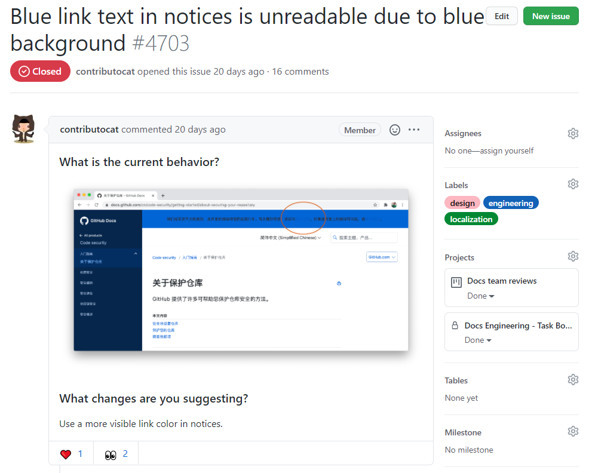
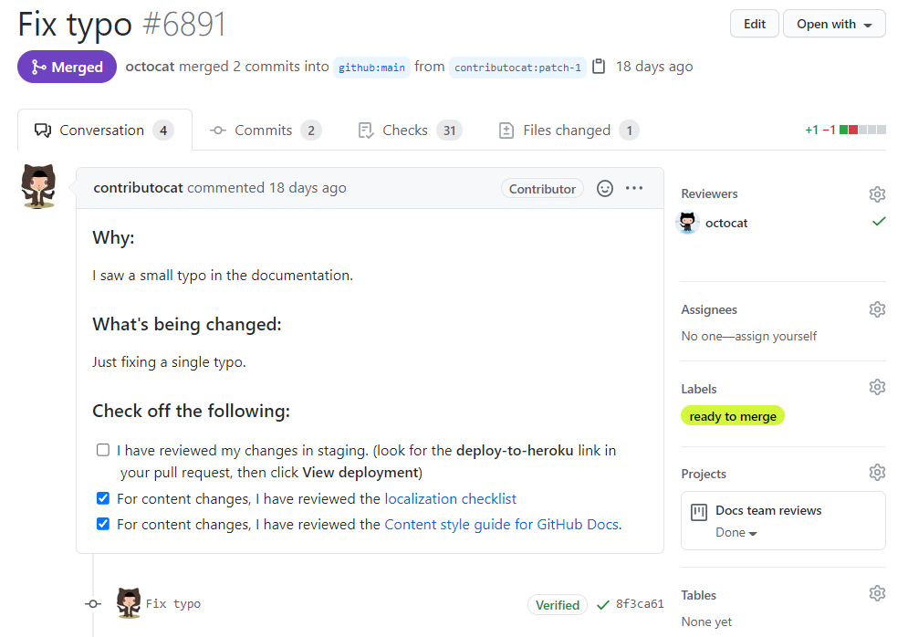
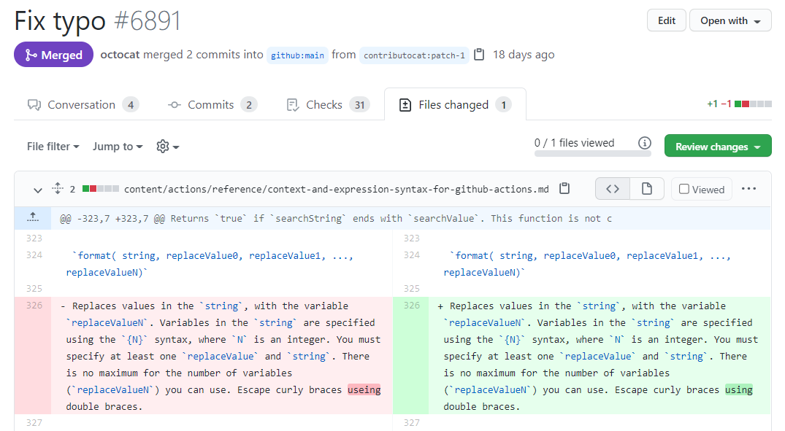
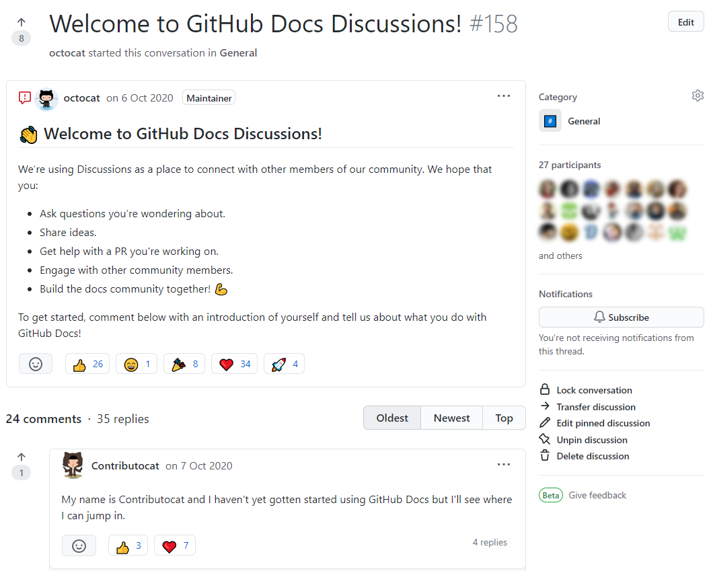
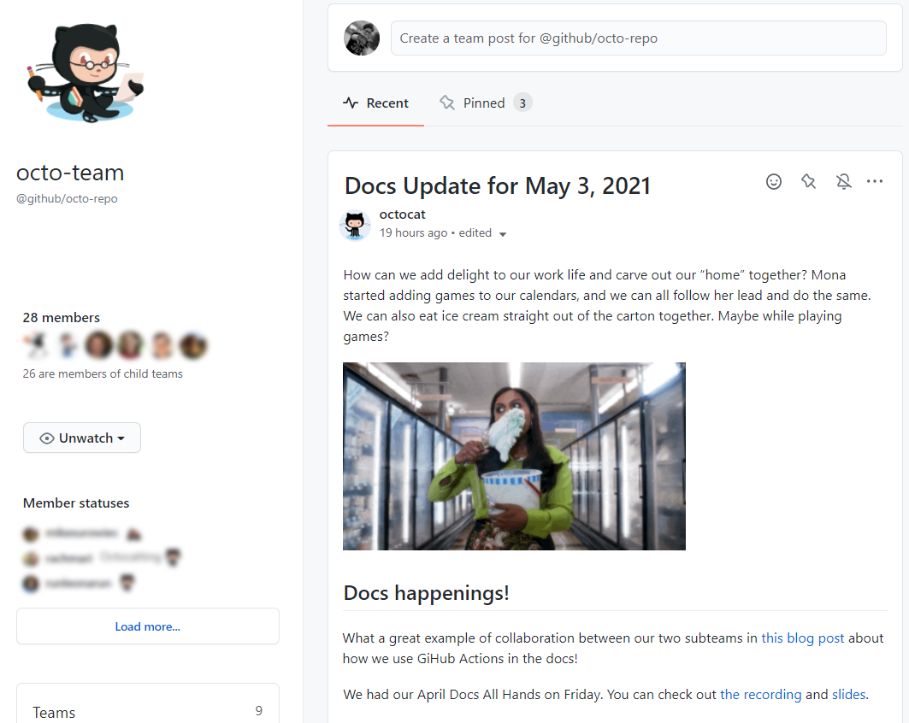

## Which discussion tool should I use?

### Scenarios for issues

- I want to keep track of tasks, enhancements and bugs.
- I want to file a bug report.
- I want to share feedback about a specific feature.
- I want to ask a question about files in the repository.

#### Issue example

This example illustrates how a GitHub user created an issue in our documentation open source repository to make us aware of a bug, and discuss a fix. 

- A user noticed that the blue color of the banner at the top of the page in the Chinese version of the GitHub Docs makes the text in the banner unreadable. 
- The user created an issue in the repository, stating the problem and suggesting a fix (which is, use a different background color for the banner).
- A discussion ensues, and eventually, a consensus will be reached about the fix to apply.
- A contributor can then create a pull request with the fix.

### Scenarios for pull requests

- I want to fix a typo in a repository.
- I want to make changes to a repository.
- I want to make changes to fix an issue.
- I want to comment on changes suggested by others.

#### Pull request example

This example illustrates how a GitHub user created a pull request in our documentation open source repository to fix a typo. 

In the **Conversation** tab of the pull request, the author explains why they created the pull request.

The **Files changed** tab of the pull request shows the implemented fix.

- This contributor notices a typo in the repository.
- The user creates a pull request with the fix.
- A repository maintainer reviews the pull request, comments on it, and merges it.

### Scenarios for GitHub Discussions

- I have a question that's not necessarily related to specific files in the repository.
- I want to share news with my collaborators, or my team.
- I want to start or participate in an open-ended conversation.
- I want to make an announcement to my community.

#### GitHub Discussions example

This example shows the GitHub Discussions welcome post for the GitHub Docs open source repository, and illustrates how the team wants to collaborate with their community.

This community maintainer started a discussion to welcome the community, and to ask members to introduce themselves. This post fosters an inviting atmosphere for visitors and contributors. The post also clarifies that the team's happy to help with contributions to the repository.

### Scenarios for team discussions

- I have a question that's not necessarily related to specific files in the repository.
- I want to share news with my collaborators, or my team.
- I want to start or participate in an open-ended conversation.
- I want to make an announcement to my team.

As you can see, team discussions are very similar to GitHub Discussions. For GitHub.com, we recommend using GitHub Discussions as the starting point for conversations. You can use GitHub Discussions to collaborate with any community on GitHub. If you are part of an organization, and would like to initiate conversations within your organization or team within that organization, you should use team discussions.

#### Team discussion example

This example shows a team post for the `octo-team` team.

The `octocat` team member posted a team discussion, informing the team of various things:
- A team member called Mona started remote game events.
- There is a blog post describing how the teams use GitHub Actions to produce their docs.
- Material about the April All Hands is now available for all team members to view.
